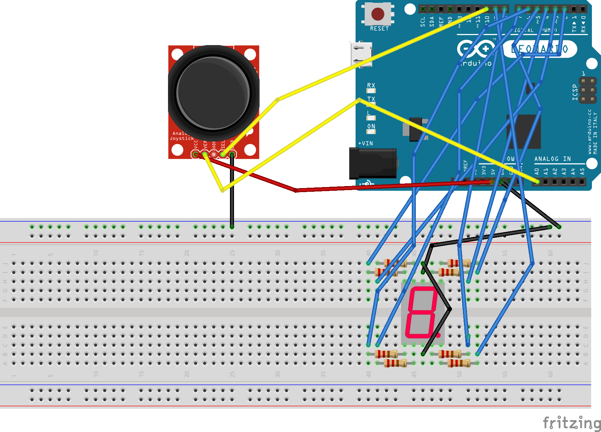

# 7-Segment-Display-Modification-using-a-Joystick
### Using a Joystick Module to change the numbers displayed on a 5161AS 7-Segment Display
+ Pushing the joystick upward increments the number displayed while pushing the joystick downward decrements the number displayed
+ Pushing the joystick in one direction long enough speeds up the change in the number displayed (default change is every 1/2 second, but after 4 increments/decrements change is every 1/4 second)
+ Pushing the button of the joystick turns on and off the decimal point
### Issues
+ Random increments of the display despite no movement of the joystick
  + This might be due to my joystick drifting and having a X-Cord value of 700-800 when steady while the typical value should be ~520
  + **NOTE:** After lots of testing this issue has naturally resolved itself but may still occur with other joysticks. Added variables for varying steady values for flexibility
+ ~~Pushing the button of the joystick while the display is incrementing/decrementing will sometimes cause the decimal point to change~~
  + ~~This is because in order for a visual change of the display a delay is needed, meaning during that period if the button is pressed the decimal point wont change~~
  + **FIXED:** Implemented using millis() instead of delay to prevent the entire program from freezing
### Wiring Diagram

### Credits
+ Gave me the basis of how a 7-Segment-Display works and the appropriate code:\
https://arduinointro.com/articles/projects/how-to-use-a-7-segment-display-with-arduino-a-complete-beginners-guide
+ Instructed the wiring and the basics of a Joystick Module:\
https://www.youtube.com/watch?v=9z5FsTzYWE4
### Disclaimer
I'm aware of the the [SevSeg](https://github.com/untr0py/SevSeg) library by Dean Reading designed for 7-Segment-Displays which makes this project alot easier and cleaner, but I wanted to challenge myself
